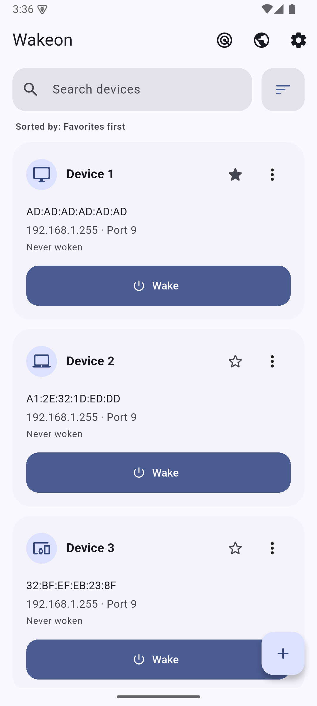
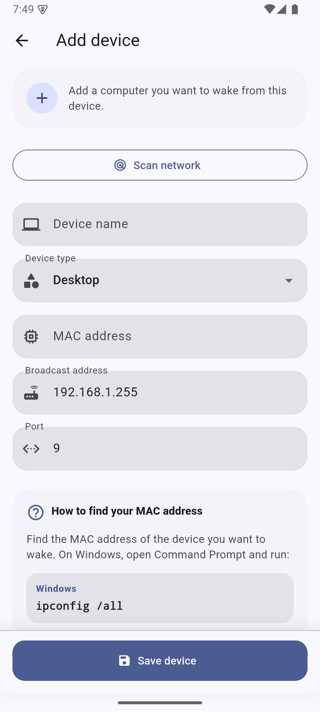
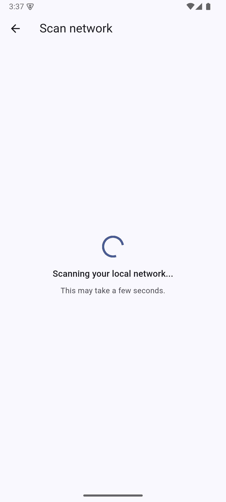
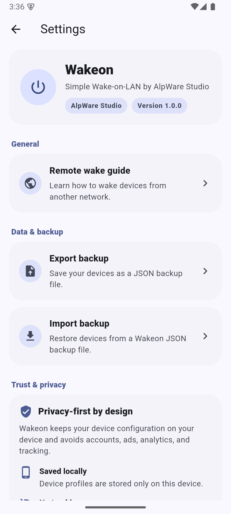
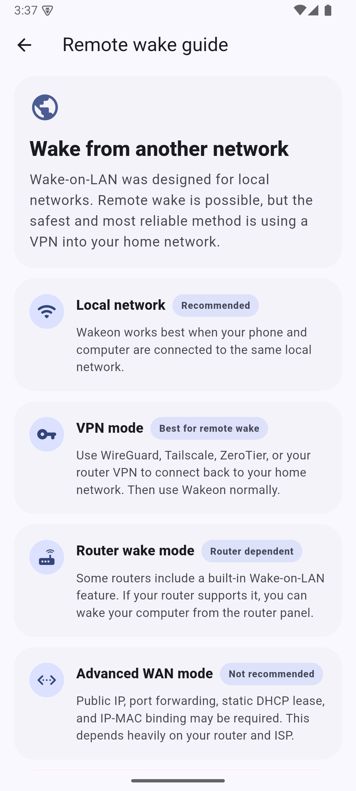
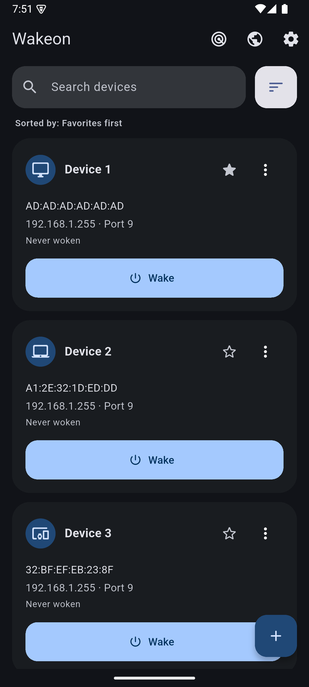

# Wakeon

[](https://play.google.com/store/apps/details?id=com.alpwarestudio.wakeon)

Wakeon is a simple, modern, and open-source Wake-on-LAN application built with Flutter.

Wake your computers, servers, NAS devices, and other Wake-on-LAN compatible hardware with a single tap.

Designed with simplicity in mind, Wakeon focuses on reliability, privacy, and a clean Material 3 user experience.

## Features

### Core Features

- Wake-on-LAN magic packet support
- Add and manage multiple devices
- Edit and delete saved devices
- Automatic last wake tracking
- Local device storage
- Fast one-tap wake action

### Network Tools

- Local network discovery helper
- Broadcast address assistance
- Manual device configuration
- Remote Wake guide

### User Experience

- Material 3 design
- Persistent system, light, and dark theme choices
- Persistent system, English, and Turkish language choices
- Responsive layout
- Beginner-friendly setup flow

### Store Experience

- Automatic update checks at most once every 24 hours
- Manual update checks from Settings
- Google Play flexible and immediate in-app update flows
- App Store version discovery by bundle ID after the iOS release is published
- In-app App Store product page, so iOS users stay inside Wakeon while updating
- Native Play Store and App Store rating sheets
- Usage-based review prompts only after meaningful successful wake actions
- Optional lifetime Premium purchase that removes all ads
- Purchase restoration across devices through the user's store account

The store integrations do not require a private API, Firebase, analytics, or a
remote configuration service. Android uses Google Play Core. iOS looks up the
public App Store record for `com.alpwarestudio.wakeon` and uses StoreKit.

### 🔒 Secure Device Sharing

- Optional share expiration
- Encrypted share links
- Easy import/export

### 🔐 Privacy First

- No account required
- No sign-in required
- No cloud dependency
- No device-profile data in ads or analytics
- Optional one-time ad-free upgrade
- Local-only device storage
- Device data remains on your device
- No user accounts

## Screenshots

| Home (Light) | Add Device |
|--------------|------------|
|  |  |

| Network Scan | Settings |
|-------------|----------|
|  |  |

| Remote Wake Guide | Home (Dark) |
|------------------|-------------|
|  |  |

## How Wake-on-LAN Works

Wake-on-LAN (WOL) allows a powered-off or sleeping computer to be started remotely by sending a special network packet called a Magic Packet.

Wakeon generates and sends this packet to the selected device.

Typical configuration:

```text
MAC Address: AA:BB:CC:DD:EE:FF
Broadcast Address: 192.168.1.255
Port: 9
```

## Getting Started

### 1. Enable Wake-on-LAN in BIOS/UEFI

Enable one of the following options depending on your motherboard:

- Wake-on-LAN
- Wake by PCI-E
- Power On By PCI-E
- Resume By LAN
- PME Event Wake Up

### 2. Configure Your Network Adapter

On Windows:

1. Open Device Manager
2. Open your Ethernet adapter properties
3. Enable:
   - Allow this device to wake the computer
   - Only allow a magic packet to wake the computer
4. Enable Wake-on-LAN related options under the Advanced tab

### 3. Add Your Device to Wakeon

You will typically need:

- Device name
- MAC address
- Broadcast address
- Port (usually 9)

## Finding Your MAC Address

### Windows

Open Command Prompt:

```bash
ipconfig /all
```

Use the Physical Address value of your Ethernet adapter.

### macOS

```bash
ifconfig
```

### Linux

```bash
ip addr
```

## Remote Wake

Wake-on-LAN was originally designed for local networks.

For remote wake scenarios, Wakeon recommends using:

- WireGuard
- Tailscale
- ZeroTier
- Router VPN solutions

Advanced WAN setups using:

- Port forwarding
- Static DHCP lease
- MAC/IP binding
- Broadcast forwarding

may work depending on your router and ISP.

## Supported Platforms

- Android
- iOS

Planned:

- Windows
- macOS
- Linux

## Tech Stack

- Flutter
- Dart
- Riverpod
- SharedPreferences
- Material 3
- Cryptography Package
- Google Play Billing / StoreKit through `in_app_purchase`

## Google Play Experience

The Android build supports native Google Play in-app reviews and in-app
updates. Automatic review prompts are intentionally conservative: Wakeon waits
until the user has configured a device, completed at least three successful
wake operations, used the app in multiple sessions, and passed a minimum
installation age. Eligibility counters remain local on the device.

## Privacy Policy

Wakeon keeps device profiles and local-network scan results on the user's
device. Advertising, aggregate analytics, and optional store purchase processing
are described transparently in the policy.

For details, see [Privacy Policy](PRIVACY_POLICY.md).

Wakeon never sends device names, MAC addresses, local IP addresses, backup
contents, or share codes to advertising or analytics services. No Wakeon user
account is required.

## Premium development override

To exercise the complete ad-free UI without changing store ownership, run a
non-release build with:

```bash
flutter run --dart-define=WAKEON_FORCE_PREMIUM=true
```

Release builds always ignore this override.

## Platform-specific store configuration

Android and iOS monetization identifiers are intentionally isolated. The
Android Premium product remains `wakeon_premium`; the iOS non-consumable is
`wakeon_premium_ios`. They can be overridden independently with
`ANDROID_PREMIUM_PRODUCT_ID` and `IOS_PREMIUM_PRODUCT_ID` build defines.

iOS release builds contain their own AdMob app, banner, and interstitial IDs.
Android release ad units must be supplied separately:

```bash
flutter build appbundle \
  --dart-define=ADMOB_ANDROID_BANNER_ID=ca-app-pub-.../... \
  --dart-define=ADMOB_ANDROID_INTERSTITIAL_ID=ca-app-pub-.../...
```

Debug and profile builds always use Google's platform-specific test ad units.
See [the iOS release checklist](docs/ios-release-checklist.md) before uploading
the first Apple build.

## Open Source

Wakeon is open-source and community-friendly.

Contributions, bug reports, feature requests, and pull requests are welcome.

## Roadmap

- Improved network discovery
- Better hostname detection
- Automatic MAC address detection
- Windows support
- macOS support
- Linux support
- Additional accessibility improvements

## License

MIT License

Copyright (c) 2026 AlpWare Studio
